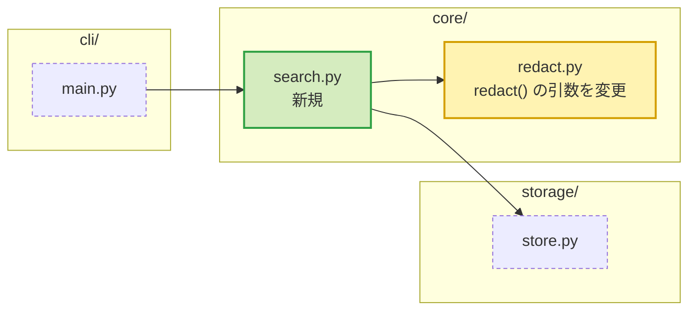
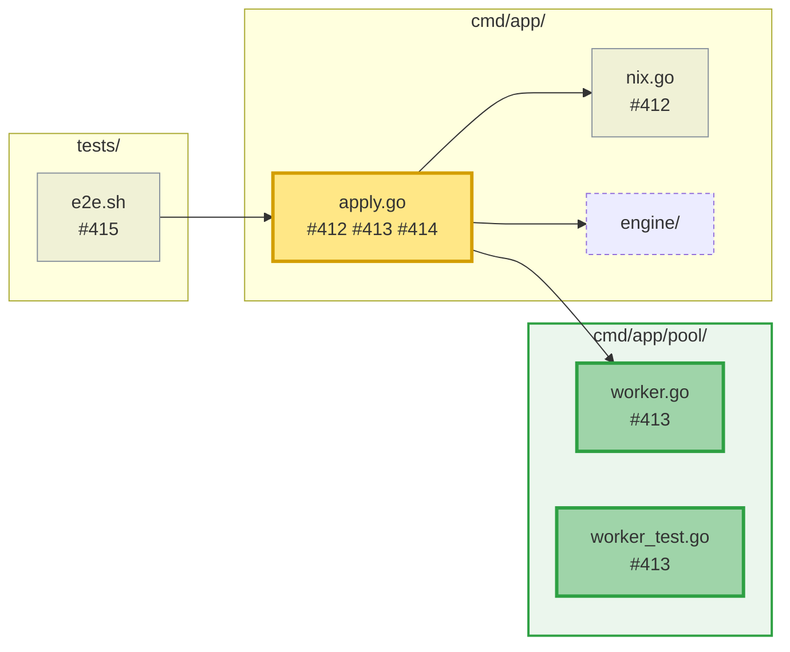
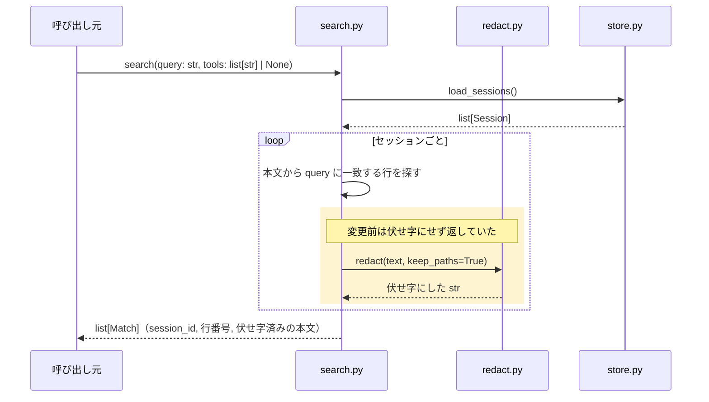
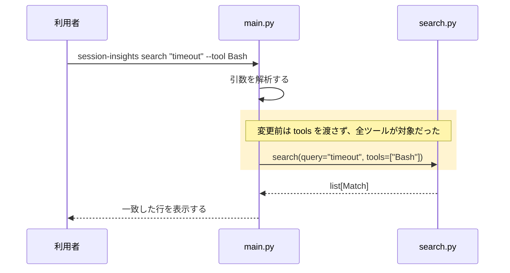
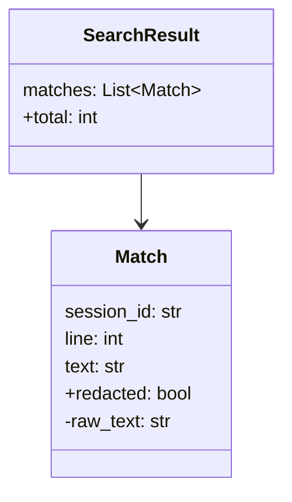
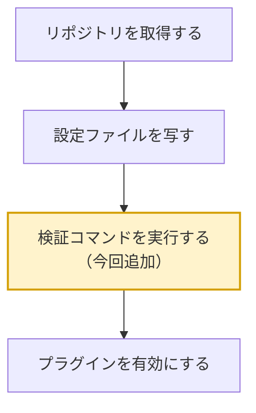

# 図の描き方

図は 5 種類。どれも「差分の行」ではなく「処理とデータの流れ」を見せるために描く。
stacked PR では、全体像の図が 2 枚になる。

## 目次

- [共通の規則](#共通の規則)
- [壊れやすい記法](#壊れやすい記法)
- [全体像の図](#全体像の図)
- [stacked PR の全体像](#stacked-pr-の全体像)
- [関数単位のシーケンス図](#関数単位のシーケンス図)
- [参照箇所起点のシーケンス図](#参照箇所起点のシーケンス図)
- [変更前後を 2 枚に分ける場合](#変更前後を-2-枚に分ける場合)
- [型の図](#型の図)
- [ドキュメント変更のフローチャート](#ドキュメント変更のフローチャート)

## 共通の規則

- 図の直前に、太字だけの行で図題を置く（`**図2: foo の入力から出力まで**`）。図題と図の間は空行 1 つ。
  コメント投稿時、この行が折りたたみの見出しになる。図題が無い図は `diagram N` と表示される。
- 図題には通し番号を付ける。本文から「図2」のように参照できる。
- 登場者はモジュール・クラス・外部システムの単位にする。関数名と受け渡すデータは矢印に書く。
  関数を登場者にすると、登場者が増えて流れが読めなくなる。
- 1 枚の目安は登場者 6 つ、矢印 15 本まで。超えるなら粒度を上げるか、図を分ける。
- 複数の図に現れる補助関数は、1 つの図でだけ中身を描く。他の図では矢印 1 本で済ませる。
- 図中の説明文は解説本文と同じ言語で書く。関数名・変数名・型名は原文のまま書く。
- 変更箇所は色付きの枠（`rect`）で囲み、`Note` で変更前の挙動を 1 行で添える。
  枠の色は `rgba(255, 196, 0, 0.18)` に固定する（明るい配色でも暗い配色でも読める）。
- 枠は、既存のコードが変わった箇所にだけ付ける。新規に追加されたコードには付けない。
  全部が新規なら図全体が枠になり、何も強調しないのと同じになる。
  変更と関係ない補足（失敗時の代替経路など）に `Note` を使うのはよい。
- 図の順序は処理の流れの順を優先する。補助関数が先の図で使われるなら、そこでは矢印 1 本にして
  「図N と同じ」と書き、中身は本来の図で描く。
- 並行に走る処理は `par` で描く。並列数が可変なら `loop` に「最大 N 並列」と書く。

## 壊れやすい記法

構文エラーの大半はラベル中の記号が原因。描く前に次を守る。

| 場所 | 書いてはいけないもの | 書き方 |
| --- | --- | --- |
| シーケンス図の矢印の文 | `;`（文の区切りになる） | `#59;` |
| シーケンス図の矢印の文 | `#`（文字参照の開始になる） | `#35;` |
| 登場者の名前 | 記号・空白を含む ID | `participant F as 表示名` で別名を付け、ID は英数字だけにする |
| フローチャートのノードの文 | 裸の `()` `[]` `{}` | `id["文"]` のように引用符で包む |
| フローチャートのノードの文 | `"` | `#quot;` |
| フローチャートのノードの文 | `<hash>` や `<!-- … -->` などの山括弧（エラーにならず、黙って消える） | `#lt;hash#gt;` |
| ノード ID・登場者 ID | `end`（ブロックの終端になる） | `End` や `finish` など別の語にする |
| 矢印の文・ノードの文の改行 | 生の改行 | ` ` |
| `alt` `opt` `loop` `rect` | 閉じ忘れ | 必ず対の `end` を書く |

型の表記（`list[str]`、`dict[str, int]`、`Result<T, E>`）はシーケンス図の矢印の文にそのまま書ける。
フローチャートのノードに書くときは引用符で包み、山括弧は `#lt;` `#gt;` にする（`"Result#lt;T, E#gt;"`）。
山括弧が消えても構文検証は通るので、描く時点で避ける。シーケンス図では山括弧をそのまま書ける。

## 全体像の図

変更箇所がどのモジュールにあり、どう繋がるかを 1 枚で示す。解説の最初に置く。

- `flowchart LR` を使い、ディレクトリや層ごとに `subgraph` でまとめる。
- ノードは変更されたファイルやモジュール。変更が 1 つのファイルに集まるときは、関数や定数の単位に分ける。
- ノードは 3 種類に色分けする。既存のものへの変更は `changed`（黄）、新規の追加は `added`（緑）、
  関係を示すために載せた未変更のものは `context`（破線）。図の直後に凡例を 1 行書く。
- 矢印は呼び出しや依存の向き。矢印の文は書かなくてよい。
- ノードは 15 個まで。超えるならディレクトリ単位にまとめる。

**図1: 変更箇所の全体像**

黄: 変更、緑: 新規、破線: 変更なし

## stacked PR の全体像

stacked PR では、全体像の節に図を 2 枚置く。

### スタックの全体像

スタックのどの段を読んでいるかを示す。自分では描かない。`stack` サブコマンドが出す STACK MERMAID を、
書き換えずにそのまま貼る。スタックの全ての PR で同じ形の図になり、現在の段だけ色が変わる。
図題は `**図1: スタックの全体像**`。図の直後に凡例を 1 行書く（「濃い色: この PR」）。

### 変更の全体像（スタック全体）

スタック全体で変更されるモジュールを描き、その中で現在の PR が担当する領域を目立たせる。
他の段の変更も載せるのは、現在の PR の位置づけが、周りがあって初めて分かるため。

- 材料は `stack` の STACK FILES。ノードには、そこを変更する PR の番号を書く（`#35;412` のように `#` は `#35;` にする）。
- 現在の PR が変更するノードは、STACK FILES の印が `A` なら `added`（緑）、それ以外なら `changed`（黄）。
  濃い色と太い枠で目立たせる。1 つのノードに新規と変更が混ざるなら `changed`。
- 他の段だけが変更するノードは `other`（灰）にする。未変更のものは `context`（破線）。
- グループ（`subgraph`）の中が全て現在の PR のノードなら、`style` でグループの背景にも色を付ける。
  色はグループ内が全て新規なら緑、それ以外は黄。
- 矢印は呼び出しや依存の向き。文書同士は矢印で結ばない。関係を示したければ同じグループに入れる。
- ノードが 15 個を超えるなら、次の順にまとめる。
  1. 他の段だけが変更するものをディレクトリ単位にする。
  2. 現在の PR の文書や試験の記録をディレクトリ単位にする。
  3. 現在の PR のコードは最後までファイルや関数の単位で残す。
- 図の直後に凡例を 1 行書く。

**図2: 変更の全体像（スタック全体）**

黄: この PR の変更、緑: この PR の新規、灰: スタックの他の段の変更、破線: 変更なし

## 関数単位のシーケンス図

変更された関数 1 つにつき 1 枚。シグネチャの入力から出力までに何をするかを示す。

- 最初の矢印は呼び出し。関数名と引数（名前と型）を書く。
- 最後の矢印は戻り値。型と中身を書く。例外を送出する経路があれば `alt` で分ける。
- 途中は、協力する相手（他のモジュール・外部システム）への呼び出しと、自分自身への矢印（内部の処理）で描く。
- 内部の処理は意味のある段階にまとめる。1 行ずつ写さない。
- 図にするのは、挙動の変化が図で伝わる関数だけ。1 行程度の包み関数、引数の追加と受け渡しだけの変更、
  属性が 1 つ増えただけの変更は図にせず、呼び出し元の図に含めるか 1〜2 文で書く。
- 分岐（`alt` `opt`）は、結果が変わる主要なものに絞る。目安は 1 枚に 2 つまで。
  引数の検査による早期の失敗は描かず、必要なら本文に 1 文で書く。分岐を全部描くと、コードを図に写しただけになる。

**図2: `search` の入力から出力まで**

## 参照箇所起点のシーケンス図

変更された関数を呼ぶ側から見た流れを描き、どこの挙動が変わったかを示す。

- 起点は直接の呼び出し元。入口（コマンドやリクエストの受け口）まで 3 段以内なら入口から描く。
- 変更された関数は登場者の 1 つとして現れる。その中身は関数単位の図に任せ、ここでは描かない。
- 呼び出し元から見て変わった点（渡す引数、受け取る値、呼ぶ順序、増えた分岐）を枠で囲む。
- 呼び出し元の挙動が変わらない場合は描かない。「呼び出し元への影響なし」と本文に 1 文書く。
- 呼び出し元が入口で、素通しするだけ（引数をそのまま渡し、結果をそのまま返す）なら描かない。
  関数単位の図の繰り返しになる。
- 1 枚で複数の変更をまたいでよい（入口から、変更された関数を順に通る流れなど）。

**図3: `main` から見た `search` の変更**

## 変更前後を 2 枚に分ける場合

既定は「変更後の 1 枚に枠と注記」。次のどれかに当たるときだけ、変更前と変更後の 2 枚に分ける。

- 登場者（モジュール・クラス・外部システムの単位で数える）が増減した。
- 呼び出しの順序が入れ替わった。
- 枠を合わせた面積が図の半分以上を覆い、どこが変わったか分からなくなる。

同じ形の変更が複数の関数にあるなら、2 枚に分けるのは 1 組だけにする。残りは変更後の 1 枚に
「`bar` と同じ組み替え」と書く。

2 枚に分けるときは図題を `**図4-a: 変更前**`、`**図4-b: 変更後**` とし、変更後の図にだけ枠を付ける。

## 型の図

型やデータ構造の定義が変更の主役のときだけ描く。関数の引数に型が 1 つ増えた程度では描かない。

- `classDiagram` を使い、変更された型と、それを持つ型・使う型だけを載せる。
- 増えた項目には `+`、消えた項目には `-` を先頭に付ける。変わらない項目は、関係の理解に要るものだけ書く。
- 型名に `<>` を含む総称型は `~` で書く（`List~Match~`）。

**図5: `Match` に伏せ字の有無を持たせる**

## ドキュメント変更のフローチャート

文書が説明する手順や構造そのものが変わった・新しく加わったときだけ描く。文言の修正には描かない。
変更が 1〜2 文で伝わるなら、図にせず文章で書く。

色は、手順の一部だけが変わったときに、変わった箇所へ付ける。全体が新規、または全面的な書き換えなら
色を付けない。全部に色が付いた図は、何も強調しない。

**図6: 導入手順の変更**

