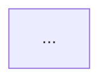

# 解説の書き方

読み手は PR を初めて読む第三者。図が主役で、文章は図から読み取れないことだけを補う。

## 構成

次の順で書く。中身の無い節は節ごと省く。見出しは解説本文と同じ言語にする。

````markdown
# PR #<番号>: <タイトル>

- PR: <URL>
- 対象: `<base のブランチ>` ← `<head のブランチ>`（head `<sha の先頭 7 桁>`）
- 図の検証: <検証済み | 未検証（mmdc なし） | 一部の図を描画できず省略（図N）>
- 参照箇所起点の図: 省略（対象リポジトリの外で実行したため）  ← degraded のときだけ書く

## 概要

何を、なぜ変えたか。3 行以内。

## 全体像

**図1: 変更箇所の全体像**



黄: 変更、緑: 新規、破線: 変更なし

## 変更の詳細

### 1. <変更の名前>（`path/to/file.py:42`）

何が変わったか。1〜3 文。

**図2: `foo` の入力から出力まで**

```mermaid
sequenceDiagram
    ...
```

**図3: `bar` から見た `foo` の変更**

```mermaid
sequenceDiagram
    ...
```

その他の参照箇所: `path/to/other.py:10`、`path/to/another.py:88`

### 2. ...

## テスト

### `foo` の変更を確かめるテスト（`tests/test_foo.py`）

| テスト | 条件 | 期待する結果 |
| --- | --- | --- |
| `test_foo_redacts_secret` | 本文に秘密情報を含む | 伏せ字にして返す |
| `test_foo_empty_query` | `query` が空 | `ValueError` を送出する |

## ドキュメントと設定の変更

- `README.md`: 導入手順に検証コマンドを追加。

## 図にしなかった変更

- `path/to/util.py:5` `old_name` → `new_name`（名前の変更のみ）

## PR 本文とコードの食い違い

- 本文は「A を削除」とあるが、`path/to/a.py:30` に残っている。
````

「変更の詳細」の節は処理の流れの順に並べる。入口に近いものを先に、奥の関数を後にする。
ファイル順は差分を見れば分かるので、解説が足す価値が無い。

図の置き場所は次のとおり。

- 複数の変更をまたぐ参照箇所起点の図は、独立した小見出しにして、関係する変更の後に置く。
- 文書のフローチャートは「ドキュメントと設定の変更」の節に置く。
  文書そのものが変更の主役（手順書の新規追加など）なら、「変更の詳細」の 1 節として扱う。

## テストの解説

PR で追加・変更されたテストは「テスト」の節で解説する。図にはしない。

- 確かめる対象（関数や変更）ごとに小見出しを分け、「変更の詳細」と同じ順に並べる。
- テスト 1 件につき 1 行。「条件」と「期待する結果」を書く。テストの実装手順（準備や後始末）は書かない。
- 「テスト 1 件」は、テストの実行系が 1 件と数える単位を指す（`test_foo`、`it("…")` など）。
  `assert` や `check` のような検証の呼び出しは、ラベルが付いていても 1 件と数えない。
  そうした単位が無いテストは、確かめる観点ごとに 1 行にまとめ、件数を添える。
- 観点でまとめるときは、1 つの対象につき 5 行程度までにする。テストの節が解説の主役にならないようにする。
- テストは実行しない。件数も内容もコードから読み取る。
- 表の 1 行は短く保つ。条件も結果も 1 句で書く。
- 1 つの対象にテストが 15 件を超えるときは、確かめる観点ごとにまとめ、件数を添える
  （「上限を超える入力（4 件）: 拒否する」）。
- 既存のテストの期待値が変わった場合は、変更前の期待値も書く（「`None` を返す（変更前は例外）」）。
- テストが無い変更を指摘しない。それはレビューの仕事。

## 文章の規則

### 短く書く

- 図で分かることを文章で繰り返さない。書くのは、図から読み取れない「なぜ変えたか」と「何が変わったか」だけ。
- 概要は 3 行以内。各節の説明は 1〜3 文。
- 前置き（「この節では〜を説明します」）と、締めの要約を書かない。
- 並ぶ項目は箇条書きにする。1 項目 1 行。

### 日本語に英単語を混ぜない

日本語で書くときは、一般の語を英語のまま使わない。英字で書くのは次のものだけにする。

- PR に出てくる識別子（関数名・変数名・型名・ファイル名・コマンド）。バッククォートで囲み、原文のまま書く。
- 日本語として定着した略語（PR、API、URL、CI、JSON など）。

| 避ける | 書き方 |
| --- | --- |
| レスポンスをパースして validate する | 応答を解析して検証する |
| fallback として default 値を return する | 代わりに既定値を返す |
| `search` が handler から call される | `search` は入口の処理から呼ばれる |
| edge case を handle する | 例外的な入力を扱う |

カタカナ語も、普通の日本語で言えるなら言い換える（「ハンドリングする」→「扱う」）。

### 簡潔な文にする

- 1 文に 1 つのことだけを書く。接続助詞（「〜が、」「〜ので、」）で文を繋げない。
- 回りくどい言い回しを削る。「〜することができる」→「〜できる」、「〜を行う」→「〜する」。
- 主語を省かない。「何が」変わったのかを文ごとに書く。
- 推測で書かない。意図が PR 本文やコミットメッセージから読み取れないときは、挙動の変化だけを書く。

### 第三者が読める内容にする

- ファイルはリポジトリ相対の `path:行` で示す。行番号は head 時点のもの。
- 手元のパス、作業中の会話の内容、差分を退避したファイルの場所は書かない。
- 不具合や改善案の指摘は書かない。解説がレビューとして読まれるのを避ける。
  例外は PR 本文とコードの食い違いだけ。事実を 1 行で書き、評価は加えない。

### 言語

解説は PR 本文の言語で書く。本文が空なら、タイトルとコミットメッセージの言語に合わせる。
日本語以外で書くときも「短く書く」「簡潔な文にする」「第三者が読める内容にする」は同じ。
